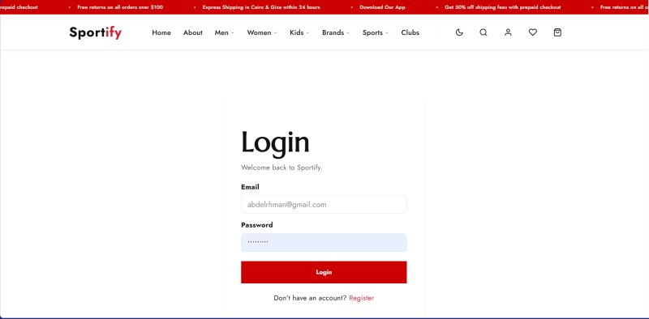
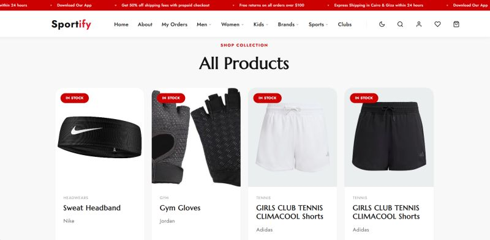
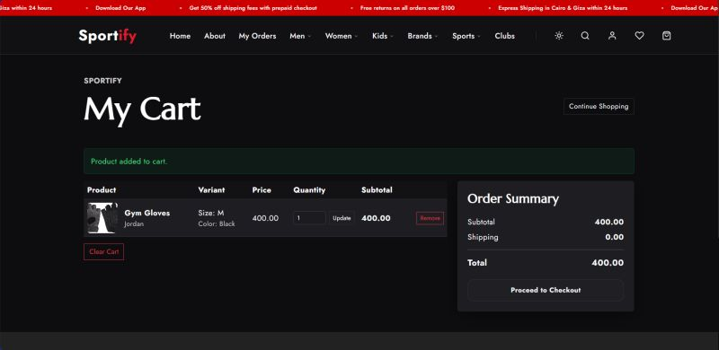
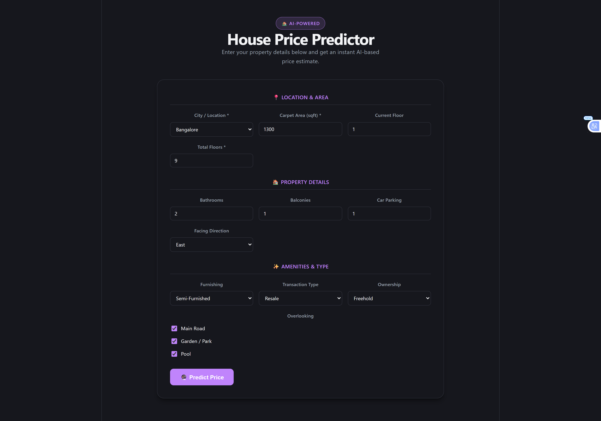
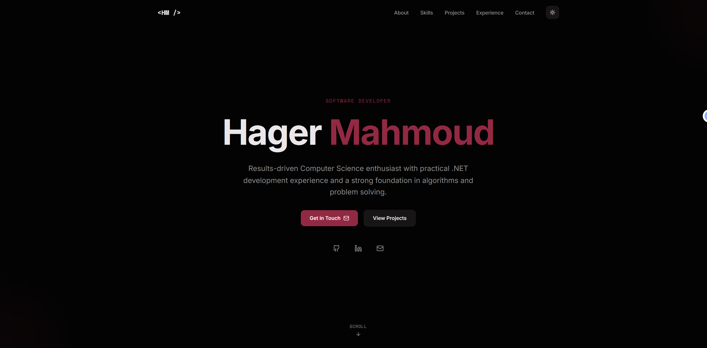
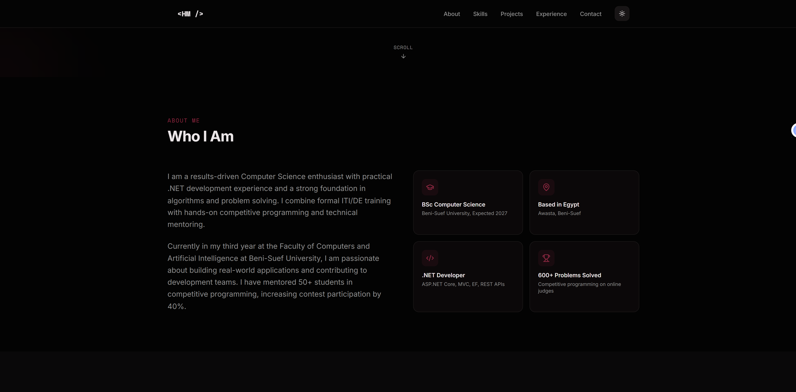
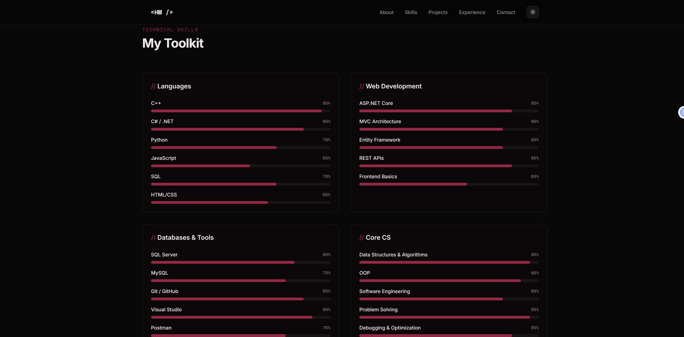
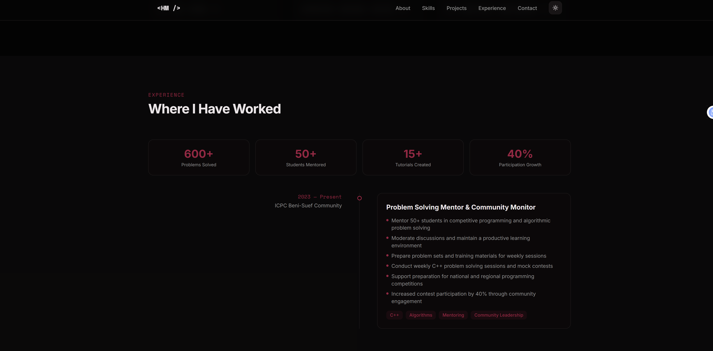
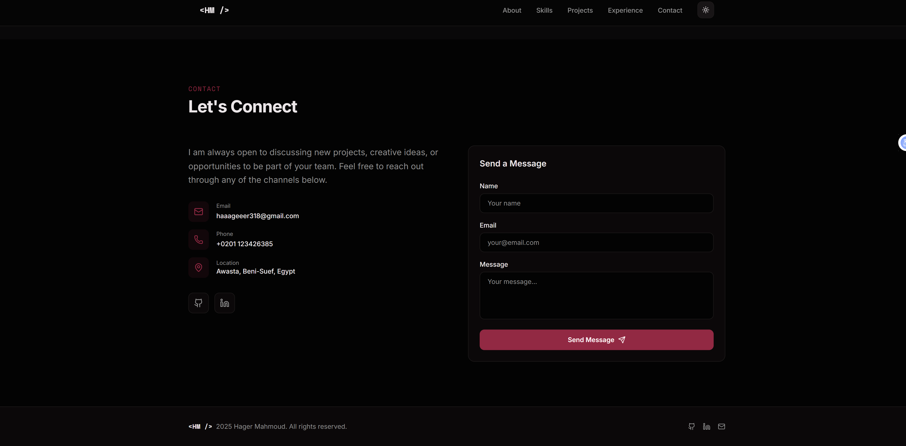

<<<<<<< HEAD
# Hager Mahmoud

Full Stack .NET Developer | Computer Science Student | Problem Solver with C++

## About

I am Hager Mahmoud, a Computer Science student and Full Stack .NET Developer dedicated to building efficient, scalable, and well-structured software solutions. With a strong foundation in Object-Oriented Programming (OOP) and Data Structures using C++, I specialize in C# and the .NET ecosystem (ASP.NET Core MVC, Entity Framework Core, SQL Server) to create secure and robust backend systems. I am passionate about writing clean code, solving complex logical challenges, and continuously learning new technologies.

## Skills

### Backend & Languages
   

### Web Development
     

### Databases & CS Fundamentals
  

## Projects

### Sportify
Repository: [Sportify](https://github.com/haaageeer/Sportify)

Sportify is a three-tiered Full Stack web application designed for sports e-commerce and fitness club management. Built on ASP.NET Core MVC (using .NET 9), Entity Framework Core, and SQL Server.

Key Features:
- Complete product catalog categorized by demographics (Men, Women, Kids) with dynamic rating metrics and variants.
- Session-based interactive shopping cart and customized checkout flow with simulated payments (COD and card validation).
- Gym Advertisement and Class/Offer Scheduler where partner gyms can publish timetables and subscription options.
- Admin review queue to verify gym submissions, plus an interactive dashboard tracking real-time sales and order stats.
- Front-end supports dynamic theme switching (Light/Dark mode) with Bootstrap 5.3 and jQuery.

| Sportify Overview | Home Page | Login Page |
| :---: | :---: | :---: |
|  |  |  |
| **Products Page** | **Shopping Cart** | **Admin Dashboard** |
|  |  |  |

---

### House Price Prediction
Repository: [House Price Prediction](https://github.com/haaageeer/house-price-prediction)

House Price Prediction is a machine learning-powered web application that predicts residential property prices in India using a dataset of ~176,000 listings across 81 cities.

Key Features:
- Backend service built with FastAPI that processes input data and serves predictions via a serialized scikit-learn Random Forest model.
- Frontend interface created with React, TypeScript, and Vite, featuring a robust multi-field prediction form and dynamic routing.
- Interactive user experience with a custom design system styled in vanilla CSS.

| Home Page | Prediction Result |
| :---: | :---: |
|  |  |

---

### Pathfinding
Repository: [Pathfinding](https://github.com/haaageeer/pathfinding)

Pathfinding is a Python-based interactive visualizer that simulates fundamental pathfinding algorithms on a 2D grid using the Pygame library.

Key Features:
- Visualizes path exploration and shortest-path calculation in real-time.
- Implemented with standard data structures utilizing Python's Queue, PriorityQueue, and LifoQueue modules.
- Supports user interaction to dynamically paint start/end nodes, draw walls/barriers, and reset the grid.

---

### My Portfolio
Repository: [My Portfolio](https://github.com/haaageeer/My_portfolio)

My Portfolio is a modern personal portfolio website built to showcase project work, skills, and experience.

Key Features:
- Built using the Next.js framework (App Router) combined with React and TypeScript.
- Clean responsive layouts styled with Tailwind CSS, utilizing Radix UI primitives and shadcn components.
- Features distinct sections for profile overview, technical skills visualizer, professional timeline experience, and contact forms.

| Home Page | About Section | Skills Section |
| :---: | :---: | :---: |
|  |  |  |
| **Experience Section** | **Contact Section** | |
|  |  | |

## Contact

- LinkedIn: [Hager Mahmoud](https://www.linkedin.com/in/hager-mahmoud-abdelhamid)
- Email: haaageeer318@gmail.com
- GitHub: [haaageeer](https://github.com/haaageeer)
=======

>>>>>>> 957722a509fda75f53cebb86eec9d44311e7c07b
